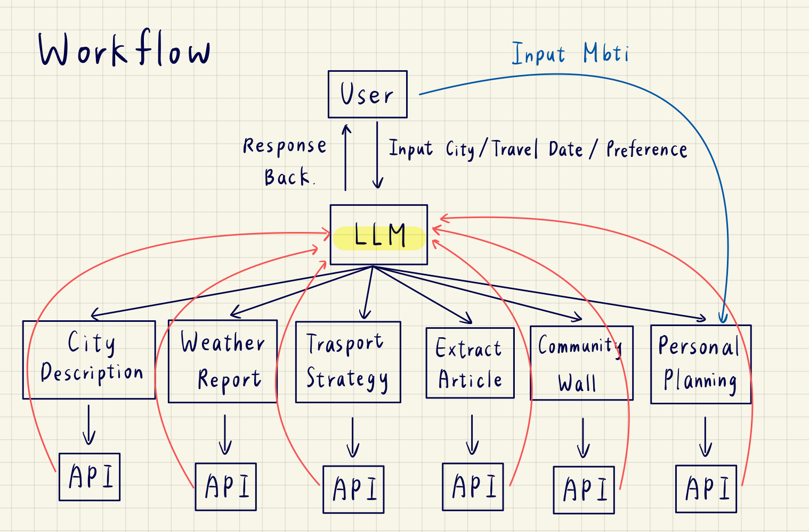

# 🌍 Soul Travel Mate - AI-Powered MBTI Travel Planner

**Soul Travel Mate** is a Streamlit-based application that leverages **Large Language Models (LLMs)**, **Open-Meteo**, and **DuckDuckGo** to create hyper-personalized travel itineraries based on a user's personality type (MBTI).

---

## 1. System Architecture

### 1.1 Application Workflow
This flowchart illustrates the data processing pipeline of the application.



### 1.2 Finite State Machine (FSM)
The application uses Streamlit's `session_state` to manage view transitions.


---

## 2. Project Structure

```text
toc-final/
├── src/        # core source code
│   ├── app.py              # Main entry point (Streamlit UI & state management)
│   ├── config.py           # Configuration & secrets loader
│   ├── services.py         # Backend logic (LLM, APIs, error handling)
│   └── utils.py            # Helper functions (HTML generation, regex)
│   └── .streamlit/
        └── secrets.toml        # API key
├── requirements.txt        # Python dependency list
└── README.md               # Project documentation

```

---

## 3. Environment Setup

Follow these steps to set up the development environment on your local machine.

### 3.1 Prerequisites
- Python 3.8 or higher
- Pip (Python package manager)
- Access to an LLM API

---

### 3.2 Installation Steps

#### Step 1: Clone the Repository

    git clone https://github.com/jason2282004/toc-final
    cd toc-final

#### Step 2: Install Dependencies

    pip install streamlit pandas requests duckduckgo-search

#### Step 3: Configure Secrets

This project uses Streamlit's native secrets management.

1. Create a folder named `.streamlit` in the project root
2. Inside it, create a file named `secrets.toml`
3. Add the following content:

    API_URL = "https://api-gateway.netdb.csie.ncku.edu.tw/api/chat"<br>
    API_KEY = "your API key"


#### Step 4: Run the Application

    python -m streamlit run app.py

---

## 4. On-site Demo
(To be demonstrated during presentation)
